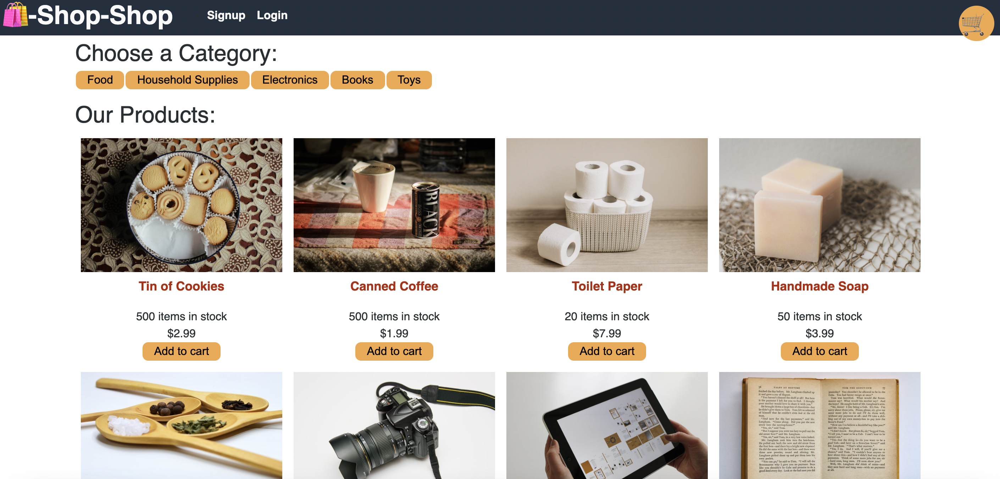

E-Commerce Redux

## Description

An online e-commerce store allowing you to buy groceries, household supplies with a React JS front end, GraphQL to make queries, and Redux to manage application state.

## Link to Deployed App

https://ecommerce-redux-store.herokuapp.com/

## Technologies Used:

- React JS
- Redux
- GraphQL

## License

MIT

## Screenshots

